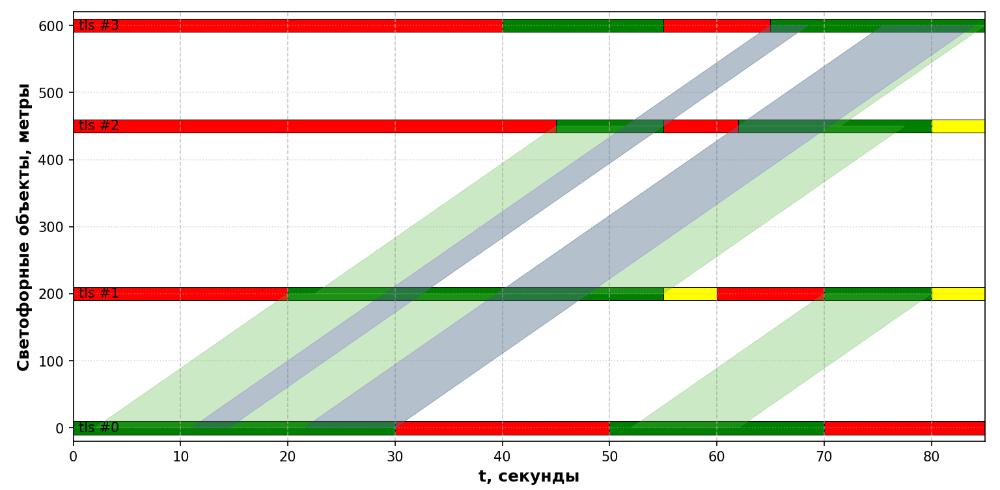
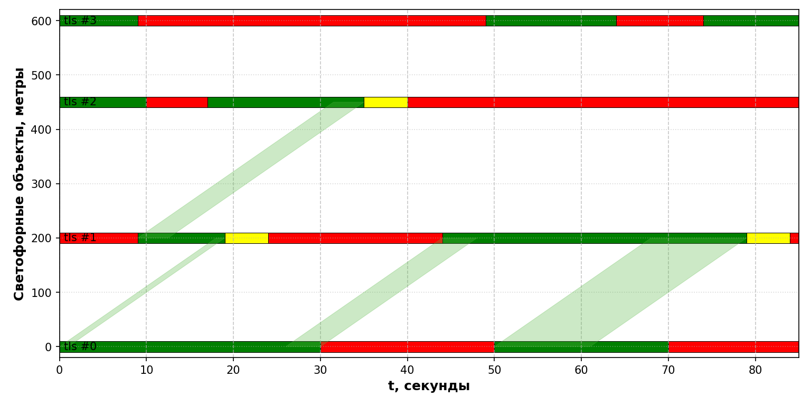
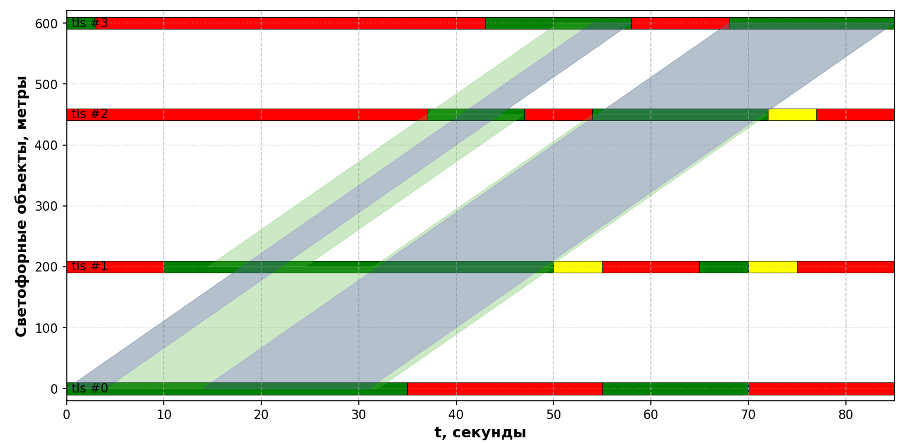

# Нахождение зелёной волны графоаналитическим методом (метод перебора)


В рамках данного проекта реализуется система оптимизации зелёной волны для координации светофоров, направленная на создание непрерывных «зеленых волн», позволяющих транспортным средствам проезжать через несколько перекрестков без остановки.


## Обзор

Система состоит из нескольких компонентов:

1. **Моделирование перекрестков**: представление светофоров с указанием длительности фаз сигналов
2. **Обнаружение «зеленой волны»**: поиск потенциальных «зеленых волн» между перекрестками
3. **Оптимизация**: настройка смещения и продолжительности сигналов для максимального увеличения пропускной способности «зеленой волны»
4. **Визуализация**: создание пространственно-временных диаграмм для визуализации результатов

## Ключевые компоненты

### `junction.py`
- Определяет структуру системы светофоров:
  - `Signal`: Запрещающий или разрешающий сигнал с временными ограничениями
  - `Phase`: Группа взаимосвязанных сигналов
  - `Junction`: Светофор с координатами и заданной последовательностью сигналов
  - `GreenInterval`: Интервалы разрешающих сигналов для светофора

### `green_wave.py`
- Основные классы для анализа зелёных волн:
  - `GreenWave`: Зелёная волна между двумя перекрёстками
  - `ThroughGreenWave`: Непрерывная волна, охватывающая несколько перекрёстков

### `green_wave_finder.py`
- Содержит алгоритмы для поиска зелёных волн:
  - `find_green_waves`: находит зелёные волны между двумя соседними перекрёстками
  - `get_green_waves`: Находит все возможные зелёные волны между всеми соседними парами перекрёстков
  - `build_chain`: Рекурсивно строит цепочки зеленых волн на основе связей между волнами
  - `extract_chains`: Извлекает цепочки связанных зеленых волн
  - `merge_green_waves`: Объединяет цепочки связанных зеленых волн в сквозные зелёные волны


### `best_offsets.py`
- Функции оптимизации:
  - `best_offsets`: Методом перебора находит наилучшее (в рамках рассматриваемого критерия) смещение начальных сигналов всех светофоров
  - `best_duration_signal_and_offsets`: Методом перебора находит наилучшие смещения и длительность сигналов с учётом ограничений задачи


### `draw.py`
- Функции визуализации:
  - `plot_time_space_diagram`: Отрисовывает пространственно-временные диаграммы сигналов
  - `plot_green_waves`: Визуализирует зелёные волны между отдельными светофорами 
  - `plot_through_wave_bands`: Визуализирует сквозные зелёные волны, проходящие через все светофоры

### `main.py`
- В нём задаём сценарий, который хотим исследовать

## Пример использования

```python
# Создадим перекрёстки
junctions = [
    Junction(0, "tls #0", 0, 0,
            [Phase(0, [Signal(30, Color.GREEN, 25, 35), Signal(20, Color.RED, 20, 20)]),
                Phase(1, [Signal(20, Color.GREEN, 15, 25), Signal(15, Color.RED, 15, 15)])
            ]),
    ...
]

# Находим оптимальные сдвиги
offsets, max_band_size = best_offsets(junctions, [0, 85], [0,0,0,0])
# Устонавливаем сдвиги
for i, offset in enumerate(offsets):
    junctions[i].set_offset(offset)
    
complete_green_waves = find_complete_green_waves(junctions, speed_kmh=40)

# Визуализируем
plt = plot_time_space_diagram(junctions)
    plt = plot_green_waves(plt, junctions, complete_green_waves.green_waves)
    plt = plot_through_wave_bands(plt, junctions, complete_green_waves.chained_green_waves)
    plt.show()
```

# Примеры визуализации данных

<center>
Зелёная волна без сдвигов
</center>



<center>
Худший результат
</center>



<center>
Финальный результат
</center>

